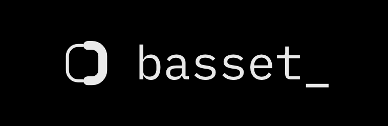

<p align="center">
  
</p>

<p align="center">Live iOS diagnostics, on demand.</p>

---

A request names instruments. This SDK activates them on the devices that match,
streams what they emit, and stops when the request expires. Nothing is captured
until a request names it.

Zero dependencies. iOS 17+. Apache 2.0.

## Install

```swift
.package(url: "https://github.com/basset-org/basset-ios", from: "0.1.0")
```

In Xcode: **File → Add Package Dependencies**, paste the URL.

```swift
import Basset

Basset.start(apiKey: "…")
```

Call it once, as early as you can — instruments that cover app launch arm from
disk before the first network call.

## The key

Create an app at [app.basset.dev](https://app.basset.dev) and copy its API key.

## Asking for a capture

```sh
brew install basset-org/tap/basset
basset auth login

basset request create --app Newswire \
                      -i swiftui.host.updates -i concurrency.mainThreadHang \
                      --purpose "home screen re-renders while idle, since 4.2.1" \
                      --user u_84213 --for 15m

basset request get <id> --format md
```

`basset menu` lists every instrument a request can name, with what each one is
for and what it reveals.

## Instruments

51 instruments across 24 domains.

| Domain | Instruments | Source |
|---|---|---|
| [`camera`](Sources/Basset/Instruments/Camera.swift) | `session.state` `session.configuration` `device.inventory` `device.format` `frames.delivery` | `AVCaptureSession` KVO · `startRunning`/`addOutput` swizzle · `AVCaptureDevice` reads — black preview, wrong format, dropped frames |
| [`swiftui`](Sources/Basset/Instruments/SwiftUI.swift) | `runtimeIssues` `host.appear` `host.updates` `presentation` `displayList.churn` | `OSLogStore` on `com.apple.runtime-issues` · `UIView.layoutSubviews` swizzle · `Mirror` walk to the renderer — update storms, state mutated during update |
| [`network`](Sources/Basset/Instruments/Network.swift) | `urlSession.taskMetrics` `path.transitions` `session.configuration` `transportSecurity` | `URLSessionTaskDelegate` proxy · `NWPathMonitor` · `NSAppTransportSecurity` read — wire timings, interface moves, blocked loads |
| [`concurrency`](Sources/Basset/Instruments/Concurrency.swift) | `mainThreadHang` `thread.inventory` `queue.latency` | `CFRunLoopObserver` · `task_threads` + `thread_info` · main-queue round trip — hangs, every thread named, queue wait |
| [`environment`](Sources/Basset/Instruments/Environment.swift) | `accessibility` `dynamicType` `locale` | `UIAccessibility` and `UIContentSizeCategory` notifications · `Locale` — switches on, text size, region |
| [`memory`](Sources/Basset/Instruments/Memory.swift) | `footprint` `pressure` | `task_info(TASK_VM_INFO)` · memory-warning notification — footprint, headroom before jetsam |
| [`cpu`](Sources/Basset/Instruments/CPU.swift) | `thread.usage` `wakeups` | `thread_info(THREAD_EXTENDED_INFO)` · `task_info(TASK_POWER_INFO)` — per-thread CPU, wakeups out of idle |
| [`storage`](Sources/Basset/Instruments/Storage.swift) | `coreData.save` `coreData.changes` | `NSManagingContextDidSaveChangesNotification` — what a save wrote, which thread ran it, churn between |
| [`log`](Sources/Basset/Instruments/Log.swift) | `faults` `subsystems` | `OSLogStore` — every framework fault in-process, who logs and how loudly |
| [`permissions`](Sources/Basset/Instruments/Permissions.swift) | `status` `changes` | `authorizationStatus` across `AVCaptureDevice`, `CLLocationManager`, `PHPhotoLibrary`, `EKEventStore`, `CNContactStore` — allowed now, moved since |
| [`uikit`](Sources/Basset/Instruments/UIKit.swift) | `viewController.appear` `view.layoutPass` `window.touches` | `viewDidAppear`, `layoutSubviews` and `sendEvent` swizzle — screen order, layout passes per second, what the finger did |
| [`lifecycle`](Sources/Basset/Instruments/Lifecycle.swift) | `app.state` `lastRunEnded` | `UIApplication` notifications · persisted run record — foreground gaps, deaths with no crash report |
| [`render`](Sources/Basset/Instruments/Render.swift) | `commit.pacing` `fps` | `CADisplayLink` — frames finished inside budget, frames actually presented per second |
| [`runtime`](Sources/Basset/Instruments/Runtime.swift) | `threadSnapshot` `stackSamples` `linkedLibraries` `methodOwners` | `task_threads` + `THREAD_STATE` walk · timed resampling · `_dyld_image_count` · `dladdr` on an implementation — every stack dSYM-resolvable, what is linked in, what somebody swizzled |
| [`power`](Sources/Basset/Instruments/Power.swift) | `thermalState` | `ProcessInfo.thermalState` notification — throttle level and every change |
| [`device`](Sources/Basset/Instruments/Device.swift) | `info` | `sysctlbyname("hw.machine")` · `ProcessInfo` · Mach-O build UUID — model, OS, build identity |
| [`notifications`](Sources/Basset/Instruments/Notifications.swift) | `settings` | `UNUserNotificationCenter.notificationSettings` — what the user left switched on |
| [`location`](Sources/Basset/Instruments/Location.swift) | `delegate.silence` | `CLLocationManagerDelegate` swizzle — updates that never arrive |
| [`bluetooth`](Sources/Basset/Instruments/Bluetooth.swift) | `central.state` | `CBCentralManagerDelegate` swizzle — powered off vs nothing nearby |
| [`webkit`](Sources/Basset/Instruments/WebKit.swift) | `contentProcess.termination` | `WKNavigationDelegate` swizzle — the white web view |
| [`map`](Sources/Basset/Instruments/Map.swift) | `tile.loading` | `MKMapViewDelegate` swizzle — blank or grey tiles, and the error |
| [`audio`](Sources/Basset/Instruments/Audio.swift) | `route` | `AVAudioSession` reads · route-change notification — earpiece instead of speaker, which microphone is listening, a category that admits none |
| [`metal`](Sources/Basset/Instruments/Metal.swift) | `drawable.presentation` `gpu.latency` | `CAMetalLayer.nextDrawable` swizzle · a timed trivial command buffer — frames that reached the screen, and what the GPU is already carrying |
| [`call`](Sources/Basset/Instruments/Call.swift) | `provider.actions` | `CXProviderDelegate` swizzle · `AVAudioSession` — CallKit actions, whether audio arrived |

Ids are the domain plus the cell: `camera.frames.delivery`, `swiftui.host.updates`.

## API

Four calls.

```swift
Basset.start(apiKey: "…")
Basset.start(Config(apiKey: "…", control: url, quicPort: 30943, http2Port: 30944))

Basset.identify(userId: "u_84213")   // so a request can target one named user
Basset.currentState()                // read-only; nil until start
```

`currentState()` returns the device id, what the control plane last answered and
when, every live request with its frame count, and the transport carrying it.
Nothing on it activates an instrument.

## What it costs

**Nothing runs unasked.** No instrument is installed, no hook applied and no
frame produced until a request naming it reaches the device. Every request
carries an expiry and a frame cap; when either is reached the instruments come
back off.

**URLs are redacted on the device.** The query string is dropped whole rather
than filtered, and path segments shaped like identifiers — numeric, an address,
a long unbroken token — become `:id` before anything leaves the process.

**No dependencies.** Mach calls, Network.framework, OSLog and KVO cover the
mechanisms. Nothing to resolve, nothing to conflict, and the whole surface reads
in an afternoon.

**Unavailable instruments are refused, not attempted.** Each declares the OS it
needs and whether it works on a simulator. A request naming one the device
cannot run is ignored the way an unknown name is.

## Transport

One stream per request, opened with that request's own token — QUIC over
Network.framework, falling back to HTTP/2 where UDP is blocked. A device moving
between wifi and cellular keeps the connection.

## Requirements

iOS 17 or later, Swift 6 toolchain. `BassetEntityComponent` — the wire vocabulary the SDK
encodes and any reader decodes — is pure Swift and builds anywhere.

## License

Apache 2.0.
